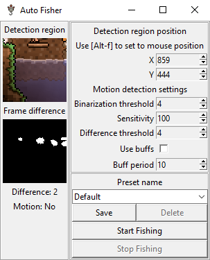
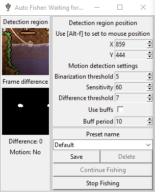

# Terraria Auto Fisher

*Conceptually a clone of [this project](https://github.com/alexesmet/terraria-auto-fisher).*
*I wanted to practice, so I remade it my way.*
*Big thanks for [alexesmet](https://github.com/alexesmet) for inspiration.*

A program that automates fishing in Terraria using computer vision.





## Run

```
$> pythonw scripts/main.py
```

## Usage

 1. Open the game in windowed mode. Load into the world and travel to 
a fishing spot
 2. Adjust the `Detection region`
 3. Check `Use buffs` if you want the program to buff periodically (`B` hotkey).
Adjust the `Buff period` (in seconds) if necessary
 4. Select your fishing pole in-game, but do not cast yet
 5. Click `Start Fishing`. The program will automatically switch to Terraria
window and cast a line
 6. Adjust parameters if needed
    * `Binarization threshold` is used to ignore small movement.
    Smaller values lead to less movement being ignored
    * `Sensitivity` is used to adjust `Difference` value.
    Greater sensitivity makes greater difference values
    * `Difference threshold` determines how high the `Difference`
    has to be to conclude that something in the detection area moves.
    If the value is too low, waves and background walls may trigger movement detection.
    If the value is too high, bobber movement might be ignored.
 7. Switching to any window other than the game will pause the program
until the game becomes active again or until `Continue Fishing` is pressed
which will automatically switch to the game window.
 8. Click `Stop Fishing` to stop fishing and reset to the initial state
 9. You can edit selected preset name in the dropdown
 10. Click `Save` to save current preset with given name
 11. Use the dropdown to switch between presets
 12. Click `Delete` to delete selected preset. You cannot delete the `Default` preset

## Tips

 * Use knock-back immunity accessories or lock your character in-place 
by other means
 * Make sure that mobs and minions don't get inside the detection region
 * Light the area up
 * Place background walls

## Requirements

 * Python 3.10
 * [requirements.txt](requirements.txt) *(Auto-generated by [pipreqs](https://pypi.org/project/pipreqs/))*
